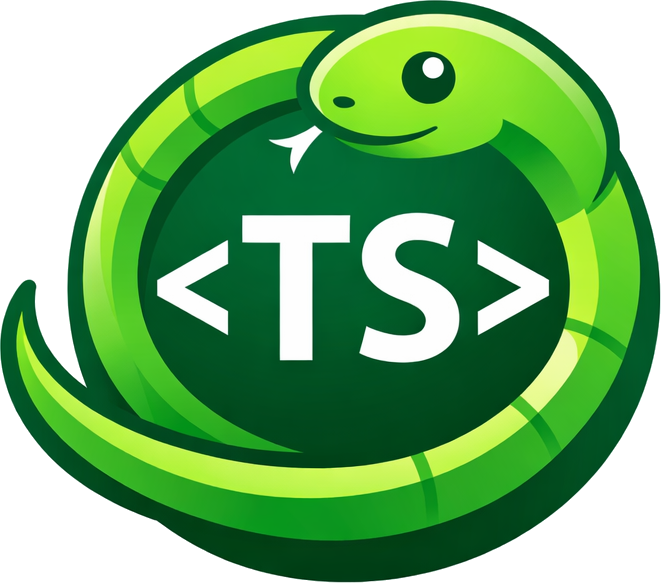
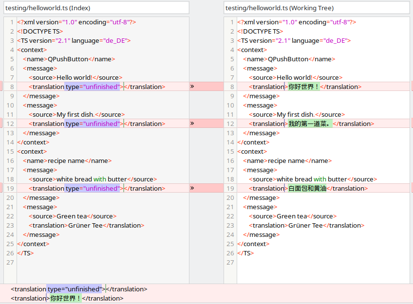

# CuteLingoExpress
CuteLingoExpress is a tool for translating Qt `.ts` files during internationalization work. It automates the translation process by letting you specify the source and target language and quickly preview how translated layouts will look. This is useful for checking whether an app's interface works well in another language before involving native speakers for final review.

**Author: Marcel Petrick <mail@marcelpetrick.it>**

**Note: projected is generated with AI.**

**License: GPLv3 or later. See `LICENSE`.**

  
The logo consists of a cute (Qt..) snake (Python) circling a upper-case TS (symbolising the tanslation files).

## Motivation
Internationalization plays a crucial role in developing successful applications, as not all customers are comfortable with English. Qt provides a comprehensive ecosystem for handling internationalization, including language support in C++/Qt and tools such as `lupdate`, `release` and `Linguist`. One thing that was missing was a quick way to automatically generate translations and review them in the context of an app's layouts. CuteLingoExpress fills that gap by automating the translation process and giving developers a convenient way to assess layout compatibility.

# Usage

## Setup
To use CuteLingoExpress, install the required package with:
`python -m pip install .`

The project is configured through [`pyproject.toml`](pyproject.toml) and currently pins `translators==5.3.1`.

## Invocation
CuteLingoExpress is invoked by providing the path to the `.ts` file that needs translation and the ISO 639-1 language codes for the source and target languages. For more information about supported language codes, refer to the `translators` documentation at https://pypi.org/project/translators/. The following examples demonstrate the usage:
```shell
python auto_trans.py testing/numerus.ts de cn
python auto_trans.py testing/helloworld.ts en cn
python auto_trans.py --version
```
Upon execution, the tool performs the translations and updates the `.ts` file in place. An example of the output could look like this:
```shell
$ python auto_trans.py testing/helloworld.ts en cn
CuteLingoExpress 0.2.4
Using Germany server backend.
translateString: 0.5832037925720215s : Hello world! -> 你好世界！ (en -> cn)
translateString: 1.0015525817871094s : My first dish. -> 我的第一道菜。 (en -> cn)
translateString: 1.534256935119629s : white bread with butter -> 白面包和黄油 (en -> cn)
TS file transformed successfully.
Whole execution took 3.1223082542419434s.
```

## Versioning
CuteLingoExpress follows Semantic Versioning (`MAJOR.MINOR.PATCH`).  
Current version is v0.2.4 (see Git tag).

The version is actively used across the lifecycle:
* The single source of truth is [`version.py`](version.py).
* Runtime code imports that version and prints it as the very first console output on startup.
* Build metadata reads the same value through [`pyproject.toml`](pyproject.toml), so packaging and runtime stay aligned.
* `python auto_trans.py --version` provides a lightweight way to surface the current release during debugging and support.
* Runtime and development dependencies are declared in [`pyproject.toml`](pyproject.toml), including the `dev` extra for local checks.

## Local pipeline
Run the complete local validation pipeline with:
```sh
./localPipeline.sh
```

The pipeline creates or reuses `.venv`, installs the project with development dependencies, checks the runtime version, runs Pylint, runs the unit tests with coverage, generates `htmlcov/index.html`, builds source and wheel distributions, installs the freshly built wheel, and verifies the installed package version.

## Handling errors
* Sometimes, the chosen backend for translation, Google, may fail to start in approximately 20% of the runs. If this occurs, you can press Ctrl+C to stop the execution and retry the translation.
* Yandex and DeepL were also quite powerful, but I quickly ran into rate limits with them (watch the output).

## Checking results
* To assess the translated content, it is recommended to use the diff command from your preferred version-control system. This allows you to compare the changes made in the `.ts` file and verify the accuracy of the translations.
  

### Additional Features
* CuteLingoExpress also handles the numerus form, providing support for translation involving plurals and singulars.
* During development, a key goal was to preserve the original file structure to minimize the differences when comparing versions. This approach ensures that the changes made during translation are easily identifiable.

## Software quality
### Unit testing
* Please run the tests in `test_auto_trans.py` to check for regressions.
```sh
python test_auto_trans.py                                                                                                     1 ✘  CuteLingoExpress  
................TS file transformed successfully.
.TS file transformed successfully.
.TS file transformed successfully.
.TS file transformed successfully.
.TS file transformed successfully.
.TS file transformed successfully.
.translateString: 1.2636184692382812e-05s : Hello world -> 你好世界 (en -> cn)
......
----------------------------------------------------------------------
Ran 29 tests in 0.036s

OK
```

* To generate coverage for the unit tests, install the development dependencies with `python -m pip install -e ".[dev]"`.
* Run `python -m coverage run -m unittest` to execute the full test suite with coverage collection.
* Run `python -m coverage report -m` to print a line-by-line coverage summary in the terminal.
* Run `python -m coverage html` to generate an HTML report in `htmlcov/index.html`.
```sh
python -m coverage report -m
Name            Stmts   Miss Branch BrPart    Cover   Missing
-------------------------------------------------------------
auto_trans.py     140      0     30      0  100.00%
version.py          5      0      0      0  100.00%
-------------------------------------------------------------
TOTAL             145      0     30      0  100.00%
```

### Linting
* `pylint` gives it a rating of 10.00/10 with release v0.2.4.
* Run `python -m pylint auto_trans.py test_auto_trans.py version.py` to lint the Python modules.
```sh
python -m pylint auto_trans.py test_auto_trans.py version.py                                                               ✔  CuteLingoExpress  

--------------------------------------------------------------------
Your code has been rated at 10.00/10 (previous run: 10.00/10, +0.00)
```

# Naming?
* The name "CuteLingoExpress" combines elements from different aspects of the tool to convey its purpose and characteristics. It blends "cute" from Qt, "lingo" representing the language translation aspect, and "express" to emphasize the tool's speed and efficiency in translating Qt content. This name reflects the tool's goal of delivering delightful and rapid translations while capturing the essence of the Qt framework.
* The development of CuteLingoExpress involved applying design-thinking methods and using GPT to refine the translation workflow and overall user experience.
